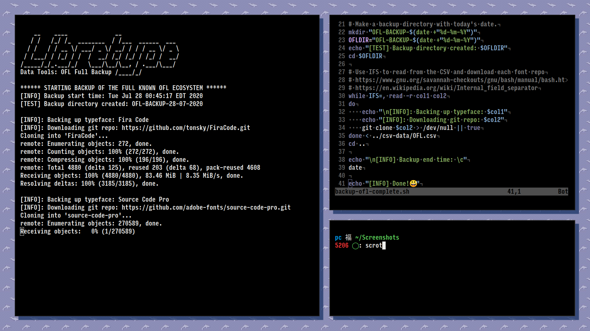

# 🧰 Libretype Data Tools
Libretype Data Tools is a collection of scripts for working with the whole [libre/open-source](https://en.wikipedia.org/wiki/Free_and_open-source_software) typeface ecosystem.
## Tools
### backup-ofl-complete.sh

>⚠️ Warning: The [CSV spreadsheet](csv-data/OFL.txt) this uses is under active development and currently only backs up popular repositories on GitHub up to about 16 stars. Pull requests are welcome to improve the [CSV spreadsheet](csv-data/OFL.txt). I hope to have this populated with at least the top 3000 OFL fonts ASAP. -Eli

This BASH script makes a backup of the full known OFL ecosystem, as defined by a [CSV spreadsheet](csv-data/OFL.csv) located in this repository.
You will need a [BASH-like](https://www.gnu.org/savannah-checkouts/gnu/bash/manual/bash.html) terminal(macOS, Linux, WSL, etc) with [Git](https://git-scm.com/book/en/v2/Getting-Started-Installing-Git) installed for it to work correctly. From the root directory of this repository, run the script and a backup directory with the current date appended will be created in the same location. To run the script ennter the command:
```
sh backup-ofl-complete.sh
```
A full OFL backup currently requiers about `30GB` of free disk space and can take a considerable amout of time depending on your internet connection speed.

If there is a typeface you want to see included, please make a pull request or issue to add it.


