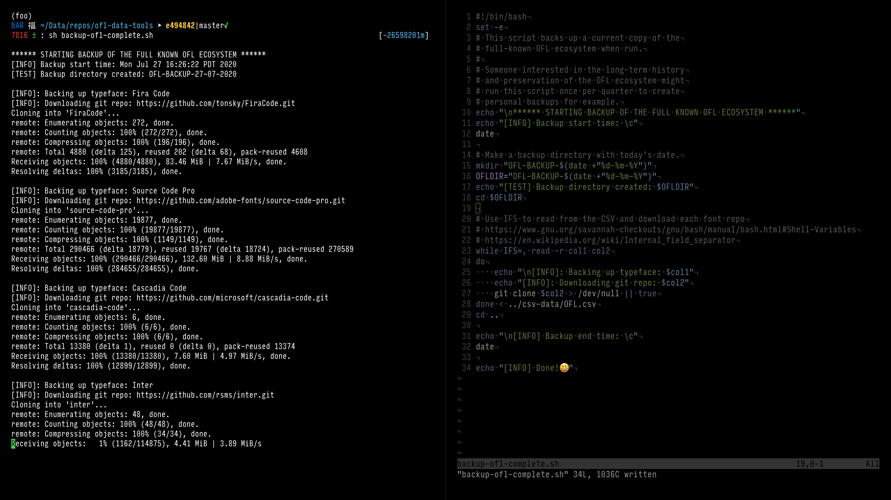

# OFL Data Tools
Scripts for working with the whole SIL Open Font License ecosystem.

# Tools:
## backup-ofl-complete.sh 
This script makes a backup of the full known OFL ecosystem, as defined by a [spreadsheet](csv-data/OFL.csv) located in this repository.
You will need a [BASH-like](https://www.gnu.org/savannah-checkouts/gnu/bash/manual/bash.html) terminal with [Git](https://git-scm.com/book/en/v2/Getting-Started-Installing-Git) installed for it to work correctly. From the root directory of this repository, run the script and a backup directory with the current date appended with be created in the same location. To run the script ennter the command:
```
sh backup-ofl-complete.sh
```


